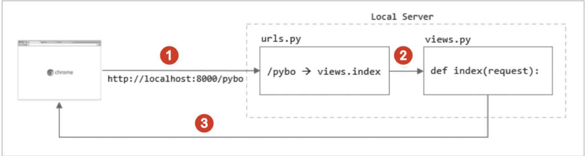
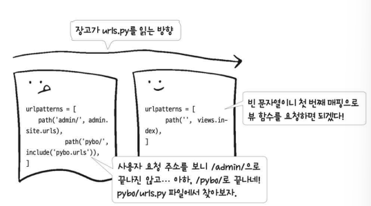
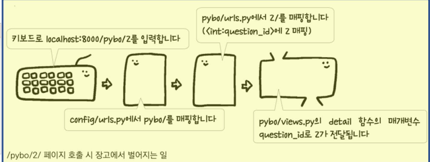
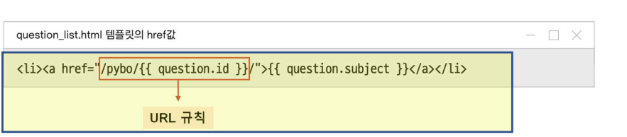

# 2-1~2-10. 장고 기본 요소 익히기!

- 앱 생성하기

```bash
# 프로젝트 디렉터리에서 실행
django-admin startapp pybo(=앱이름)
# 이후 앱 이름의 디렉토리가 하나 생긴다.
```

# 02-1 주소와 화면을 연결하는 URL과 뷰

- **URL 매핑** 추가하기

```python
# config/urls.py에서는 URL과 pybo/views.py의 특정함수(여기선 우선 페이지라고 생각하자.)를 매핑한다.
path('pybo/', views.index)

# config/urls.py에서 URL 매핑을 추가한 후
# pybo/views.py 에서 매핑된 함수 만들기
```

- 장고 개발 흐름

  

- URL 분리
  - pybo 앱을 만들면 **pybo/urls.py**를 따로 만들어 pybo와 관련된 URL만 관리 할 수 있다.
    

# 02-2 데이터를 관리하는 모델

## config/settings.py 소개

- **앱 관리**
  - 기본 앱 설치된 것을 볼 수 있다.(인증, 인가 등등)
  - pybo 같이 앱을 생성하면 여기에 등록해줘야한다.
- **데이터베이스 관리**
  - 기본적으로 pybo 말고 장고 기본 앱들이 미리 설치가 되어있다. 이를 관리하기 위한 데이터 테이블을 만들기 위해서 아래 명령어를 실행해준다.
  ```python
  # 기본 데이터 베이스 테이블 생성
  python manage.py migrate
  ```

## pybo 앱 등록

- 장고가 pybo 앱을 **인식**하기 위해서는 **config/settings.py**에 앱을 설정해줘야 한다.
  ```python
  # PyboConfig 클래스는 pybo/apps.py에 자동으로 생성된 클래스
  INSTALLED_APPS = [
  	'pybo.apps.PyboConfig',
  	...
  ]
  ```

## pybo 앱 관련 데이터 모델

- pybo는 질문,답변 관련 서비스이다. 이를 위해 질문, 답변에 대해 필요한 데이터 속성들을 구성해 특정 데이터 구조를 만들어야 한다. 이를 데이터 모델이라고 한다.
- 필요한 데이터 모델
  - 원래는 **SQL문**으로 데이터 테이블을 만들어야하지만, 프로그래밍 언어로 **ORM**을 이용해서 **모델**을 만들어 데이터 테이블 구조를 만들 수 있다.

| 질문 모델 → | 속성           | 답변 모델 → | 속성           |
| ----------- | -------------- | ----------- | -------------- |
|             | 질문 제목      |             | 답변한 질문    |
|             | 질문 내용      |             | 답변 내용      |
|             | 질문 생성 일시 |             | 답변 생성 일시 |

- 데이터 속성 특징(위 모델 속성들이 어울리는 타입은?)
  - CharField: 글자 수 제한이 있는 데이터 → 제목, 짧은 글
  - TextField: 글자 수 제한이 없는 데이터 → 내용, 긴 글
  - DateTimeField: 날짜, 시간 관련 속성 → 생성 일시, 시간 및 날짜
- **데이터 외래키(ForeignKey)**
  - 질문과 답변을 연결해야한다. 이럴때 질문의 id를 답변 모델 속성에서 의 ‘답변한 질문’에 매칭시키면 된다.
  - 이렇게 설정하면 외래 데이터 테이블(질문 모델)에서 데이터를 매칭 했기 때문에 답변한 질문 속성을 ‘외래키’라고 한다.
  - 질문 하나에 여러 답변이 달릴 수 있다.
    - on_delete=models.CASCADE 설정을 해주면 한 질문이 삭제되면 질문과 관련한 답변들이 모두 사라진다.
- 데이터 모델 코드 예시

```python
# models.Model 이라는 클래스를 상속해 테이블을 만든다.
class Answer(models.Model):
	question = models.ForeignKey(Question, on_delete=models.CASCADE)
	content = models.TestField()
	create_date = models.DateTimeField()
```

- 데이터 모델로 테이블 생성

  - 데이터 모델을 수정할 때마다 아래 과정을 반복해주자.

  ```python
  # 테이블 작업 파일 생성: 장고가 테이블 작업을 수행하기 위한 파일 생성
  # pybo/migrations에 파일이 새로 생긴다.
  python manage.py makemigrations

  # 실제 테이블 생성(실제 데이터 베이스에 반영)
  python manage.py migration
  ```

## 데이터 CRUD(생성/조회/수정/삭제, in 장고 shell)

- 질문 데이터 **생성**

```python
# 장고 shell 실행: 장고에 필요한 것들이 구축된 환경
python manage.py shell

#  질문 생성
from pybo.models import Question, Answer
from django.utils import timezone
q = Question(subject="질문 제목", content="질문 답변", create_date = timezone.now())
q.save() # 데이터 베이스에 저장

# 첫 번째 질문데이터이면 id는 1이다.
q.id
```

- **모든** 질문 데이터 **조회**

```bash
# 질문 목록 조회
Quesiton.objects.all()

# 위는 목록을 조외하면 질문의 id만 나와서 어떤 질문인지 확인하기가 힘들다. 만약 질문 제목을 보고 싶다면 모델 클래스를 수정해야한다.
# pybo/models.py에서 질문 모델에 메서드 추가
# 참고로 이때는 makemigeations, migrate 안해줘도 된다. 모델 속성이 변경된 것은 아니기 때문이다.
def __str__(self):
	return self.subjects

# 다시 shell로 돌아와서

```

- **조건** 질문 데이터 **조회(여러 개, 한 개)**

```bash
# QuerySet으로 반환: 여러개가 반환될 수 있다, 조건에 맞는 것이 없으면 빈 것 반
Quesition.objets.filter(id=1)
Quesition.objets.filter(subject__contains='장고') # 제목에 장고가 포함된 질문 반환

# 하나만 조회하기, 조건에 맞는 것이 없으면 에러
Question.objects.get(id=1)
```

- 질문 데이터 **수정**

```bash
# 위에서 정의한 q를 이용한다.
q.subject = '원하는 제목'
q.save() # 데이터 베이스에 반영하도록 저장하기
```

- 질문 데이터 **삭제**

```bash
# 위에서 정의한 q를 이용한다.
q.delete()
```

- **답변** 데이터 **생성**

```bash
# 위에서 정의한 q를 이용한다.
# q.id가 아니구만! 데베 저장 방식이랑 헷갈리지 않기.
a = Answer(question=q, content='답변 내용', create_date=timezone.now())
a.save()

# 아래처럼 실행하면 질문 제목이 나온다.
a.question
```

- **특정 질문과 연관된** 답변 보기

```bash
# 질문과 답변은 1:N 관계이다. QuerySet을 반환한다.
# 위에서 정의한 q를 이용한다.
q.answer_set.all()

# 비교: 질문과 상관없이 답변 전체를 볼 때는
Answer.objects.all()
```

# 02-3 개발 편의를 제공하는 장고 Admin

- 말 그대로 개발 편의를 제공해준다. 사용해보면 안다!
- **슈퍼 유저 생성**

  ```bash
  # 슈퍼 유저 생성
  python manage.py createsuperuser

  # 이후 관리자 아이디 생성 과정이 나온다
  # 이후 장고 서버를 실행하고 localhost:8000/admin 접속하여 로그인
  ```

- **슈퍼 유저로 모델 관리하기**

  ```bash
  # pybo/admin.py
  from django.contrib improt admin
  ...

  admin.site.register(Question)

  # 위와 같이하면 관리자 페이지에서 pybo 질문 모델 데이터를 관리할 수 있다.
  ```

  - 데이터 추가 수정 삭제
    - 관리자 페이지에서 쉽게 웹페이지 화면으로 데이터를 CRUD 할 수 있다.
  - 데이터 검색 기능

  ```bash
  # 질문 제목으로 데이터를 관리자 페이지에서 검색하고 싶을 때
  # pybo/admin.py
  class QuestionAdmin(admin.ModelAdmin):
  	search_fields = ['subject']

  admin.site.register(Question, QuestionAdmin)
  ```

# 02-4 질문 목록과 질문 상세 기능 구현하기

## 모델 데이터 관리

- 모델 데이터 최신순으로 불러오기

```bash
# order_by: 특정 속성으로 정렬

# 모델 데이터 최신순으로 불러오기
question_list = Question.objects.order_by('-create_date')

# 모델데이터 오래된 순으로 불러오기
question_list = Question.objects.order_by('create_date')
```

## **render():** 화면 출력하기

- 화면 출력하기

```bash
# context라는 데이터를 question_list.html에 적용하여 html 코드로 변환
render(request, 'pybo/question_list.html', context)
```

## templates: 템플릿 파일(html) 관리 디렉터리

- templates 디렉터리
  - html 파일들을 저장하는 곳이다.
  - pybo 관련 템플릿 파일 디렉터리
    - pybo 앱 관련된 템플릿들은 templates /pybo 디렉터리를 만들어 관리한다.
- 템플릿 파일 적용하기 기초공사
  - config/settings.py 에서 templates 디렉터리를 적용한다.
  - 여러 개의 템플릿 디렉터리를 등록할 수 있다.
  ```bash
  TEMPLATES = [
  	{
  		...
  		'DIRS': [BASE_DIR / 'templates'],
  		...
  	}
  ]
  ```
- 템플릿 **태그**
  - 템플릿 파일에서 로 둘러싸인 문장
    - : 조건문, for문에 주로 적용
    - {[ … }}: 출력

## 기능 및 화면 구현하기 순서

- url 매핑 추가 → url 매핑 함수 만들기 → 페이지가 필요하다면 페이지 만들기
  

  - 전달하는 매개변수, 데이터 확인하고 페이지에 매칭하기

  ```bash
  # url 매개변수
  ...
  path('<int:question_id>/', views.detail),
  ...

  # views 함수 매개변수 받기
  def detail(requestm question_id):
  	...
  	context = {'question': questuon}
  	return render(request, 'pybo/question_detail.html', context)

  # html 템플릿 파일에 템플릿 태그로 데이터 매칭
  ...
  <div>{{quesiton.subject}}</div>
  ...
  ```

## 올바른 오류 화면 구현

- 잘못된 주소로 접속했을 경우를 대비하기 위해서 올바른 오류를 내보내는 장치를 만든다.

```bash
# 존재하지 않는 페이지를 접속 했을 경우 404 출력
# 모델의 **기본키**를 이용하여 모델 객체 반환
get_object_or_404(Question, pk=quesiton_id)
```

# 02-5 URL 더 똑똑하게 사용하기

- URL 하드코딩을 개선하자.
- url 주소는 언제든지 바뀔 수 있어서 urls.py 파일 외에서 사용할 때는 주소가 매핑된 별칭으로 해놓고 쓰는 것이 좋다.
  - 이렇게 안하면 모든 템플릿의 url를 하나하나 바꿔야함!
    

## **URL 별칭**

```bash
# 매핑 추가 시 별칭 적용
...
path('<int:question_id>/', views.detail),
...

# 사용 전
<a href='pybo/{{ question_id }}' ...

# 사용 후
<a href='' ...
```

## **URL 네임스페이스**

- 지금은 pybo 앱만 있지만 다른 앱이 있고 url의 별칭이 비슷한 것이 있다면 중복이 발생할 것 이다.

```bash
# 1. 네임 스페이스 설정
# pybo/urls.py
app_name = 'pybo'

# 2. 템플릿 url 수정하기
<a href='' ...
```

# 02-6 답변 등록 기능 만들기

## 템플릿 문법 적용하기

- for 문으로 질문 리스트 화면에 나타내기
- {{ }}로 출력할 값 표시하기

## csrf_token

- form 엘리먼트를 통해 전송된 데이터가 실제로 웹 브라우저에서 작성된 데이터인지 판단하는 검사기 역할을 한다.
- 안 달아주면 오류난다! 아니면 settings.py 에서 사용 안하도록 설정하면 된다.

## form

- 각 input 태그에 name을 붙이면, post 요청을 받았을 때 name으로 원하는 값들을 확인할 수 있다.

## 답변 등록 함수(이벤트 핸들러)

- 질문에 대한 답변을 생성하는 함수, 이벤트 핸들러

```bash
# **질문**에 대한 답변이기 때문에 답변을 저장하려면 답변이 달린 질문을 불러야한다.
quesiton = get_object_or_404(Question, pk=question_id)
quesiton.answer_set.create(content=request.POST.get('content'), create_date=timezone.now())
# request.POST.get('content')는 post로 전달된 데이터 중 답변 내용을 가져온다는 뜻이다.
return redirect('pybo:detail', quesiton_id = question.id)
```

## redirect(): 페이지 이동

- 함수에 전달된 값을 참고하여 페이지 이동을 수행한다.
- render는 바로 context를 전달하여 이를 페이지에 매핑 시킬 수 있다.
- 하지만 검색해보니 redirect는 그것이 힘들다고 알고 있다.

# 02-7 화면 예쁘게 꾸미기

- 스타일 시트 기초 공사

  - 스타일 시트나 사용할 이미지는 static 파일에 저장한다.

    ```bash
    # base.html에 아래를 맨 위에 쓰고
    

    # 스타일 시트를 적용한다.
    <link rel='stylesheet' type='text/css' href=''>
    ```

- 박스 모델
- 레이아웃
- 포지션

# 02-8 부트스트랩으로 더 쉽게 화면 꾸미기

- Bootstrap

# 02-9 표준 HTML과 템플릿 상속 사용해 보기

## 표준 HTML 구조

- html
- head
  - css
  - meta
  - title
- body

## 템플릿 상속

```bash
# 부모 탬플릿('base.html')
# 여기서 스타일 시트를 적용하면 상속한 탬플릿에도 자동으로 적용된다.



# 상속한 페이지 구조


...내용...

```

# 02-10 질문 등록 기능 만들기

## 질문 폼 클래스 만들기

- form.is_valid(): 폼 상태를 간편하게 확인 할 수 있다.
- 이미 만들어진 것이라 관리하기에 간편하다.
- 만드는 법
  - **form.ModelForms** 클래스 상속
  - 내부 **Meta** 클래스에 사용할 모델과 모델 필드 등록

## 질문 폼 질문 등록 페이지에 반영하기

### form.as_p 이용 방식

- **자동 html 코드 생성**
  - 등록했던 필드로 입력 칸 생성
- **labels**
  - 입력 칸 라벨 등록하기
- **widgets**
  - 부트스트랩 적용할 수 있지만 완벽하지는 않다.
  - HTML 코드가 자동으로 생성되므로 디자인 측면에서 많은 제한이 생긴다. 폼 엘리먼트 내에 특정 태그를 추가하거나 필요한 클래스를 추가하는 작업에 제한이 생긴다.
  - 디자인 영역과 서버 프로그램 영역이 혼재되어 웹 디자이너와 개발자의 역할을 분리하기도 모호해진다.

### 수작업 방식

- 부트스트랩 적용 가능
- widgets 등록 안하고 직접 탬플릿 제작
- |default_if_none:’’
  - input의 value에 값이 없을 경우를 대비해 템플릿 미리 설정
  - 나중에 오류나서 같은 페이지 로드 될 때 기존에 썼던 페이지 저장하기 위해서

## GET, POST에 따른 같은 question_create URL 요청 관리

- 우선 하나의 URL을 urls.py에 등록한다.
- **GET과 그 외 요청:** 질문 리스트가 보이는 페이지에서 질문하기 버튼을 눌렀을 때
  - 이벤트 핸들러가 하는 일
    - 빈 form을 생성
    - render: 폼과 함께 질문 생성 페이지 그리기
- **POST 요청:** 질문 생성 페이지에서 저장하기 버튼을 눌렀을 때
  - 이벤트 핸들러가 하는 일
    - form 생성: 질문 생성 페이지에서 쓰여진 내용을 저장한 form 생성
    - form 임시 저장: form에는 질문 제목과 질문 내용만 있기 때문에 생성일시가 없는 상태라 임시 저장하고 form을 반환**(commit=false)**
    - create_date 속성 추가 후 데이터베이스에 저장
    - redirect: 다시 질문 목록 페이지로 이동
  - **폼 오류가 나면 다시 페이지가 그려진다.**

## 답변 등록 기능에도 폼 생성하고 적용하기

- **GET과 그외 요청**
  - 답변 생성 전용 페이지가 없다.
  - 이벤트 핸들러가 하는 일
    - 빈 form 생성, 질문 id로 질문 불러오기
    - render: 폼과 함께 질문 상세 페이지 그리기
- **POST 요청**
  - 이벤트 핸들러가 하는 일
    - form 생성
    - form 임시 저장
    - create_date 속성 추가 후 데이터베이스에 저장
    - redirect: 다시 질문 목록 페이지로 이동
  - **폼 오류가 나면 다시 페이지가 그려진다.**
