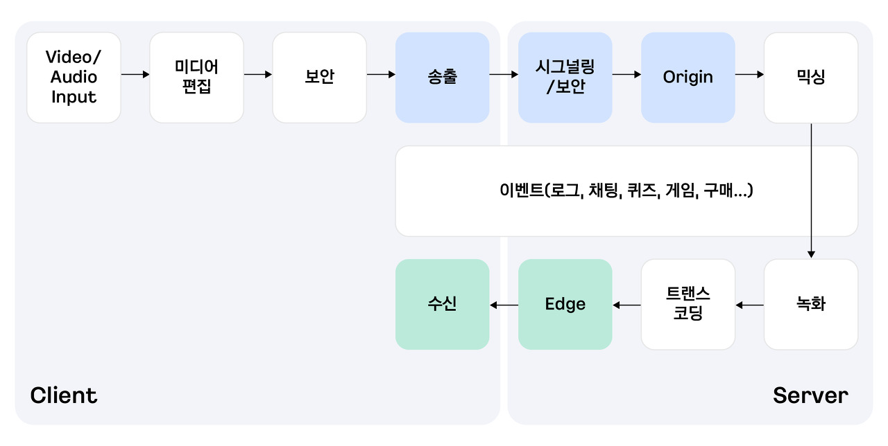

# WebRTC

[WebRTC 응용 서비스를 개발하는 방법](https://tech.kakaoenterprise.com/121)
[[개발] WebRTC & SpringBoot & Vue.js를 활용한 Group Video Call 1 : 이론](https://velog.io/@jsb100800/%EA%B0%9C%EB%B0%9C-WebRTC-SpringBoot-Vue.js%EB%A5%BC-%ED%99%9C%EC%9A%A9%ED%95%9C-Group-Video-Call)

## 1. WebRTC란?

- 서버를 최대한 거치지 않고 P2P로 브라우저나 단말 간에 데이터를 주고 받을 수 있는 기술
- 웹에서 실시간 미디어 스트림을 송수신할 수 있는 유일한 표준, 유일한 P2P 표준

### WebRTC의 특징

- 웹에서 사용할 수 있는 유일한 P2P 기술
- 이를 구현하기 위해 팔요한 서버 2개
  - Signaling Server: 각각의 기기가 서버 도움 없이 연결되기 위해 연결을 도와주는 서버
  - TURN Server: P2P 연결이 불가능할 경우, 서버를 거쳐 데이터를 전송하는 서버
- UDP 기반의 스트리밍 기술 사용
  - 빠르게 데이터를 전송할 수 있음

## 2. WebRTC의 활용 분야

### 1) 1:1

- P2P 기반의 실시간 통화 기능을 구현할 수 있음
- 전화 서비스 등을 대체할 수 있다.
- ex) 하이퍼커넥트의 Azar, 카카오톡, 보이스톡

### 2) 1:N 방송 서비스

- 기존 방송 기술의 지연시간은 보통 5~20초로 3초 아래의 지연시간을 보장하기 어렵다.
- 낮은 지연시간을 필요로하는 생방송 서비스에 적합하다.(레이턴시가 낮다.)
- ex) Hopin과 같은 웨비나 서비스

### 3) N:N 회의형 서비스

- ex) 클럽하우스

- 그 외 다양한 분야에서 WebRTC를 활용한 서비스를 개발할 수 있다.

## 3. WebRTC의 기술의 어려움

- 전문가가 부족하고 기술 자체가 어렵다.

### 1) 네트워크 환경에 따른 품질의 불확실성

- UDP 기반의 기술이기 때문에 네트워크 환경에 따라 품질이 달라진다.

### 2) 고난이도의 미디어 처리 영역

- 1:1 통화 서비스가 아닌 화상회의나 방송 서비스를 개발하려면 다양한 미디어 처리를 위한 서버들이 필요하다.
  
- '송출'에서 'Origin'에 이르는 부분과 'Edge'에서 '수신'에 이르는 과정만이 WebRTC가 관여하는 부분이고 나머지는 모두 각자의 플랫폼과 각자의 방식으로 구현하거나 감안해야 하는 영역이다.
- WebRTC가 관여하는 부분 외에도 다양한 영역에서 고려해야 할 부분이 많다.

### 3) 대용량 처리 및 클라우드

- WebRTC 미디어 서버: WebRTC 기반의 미디어 스트림을 중개 및 분배하는 역할을 하는 서버
  - WebRTC 기반의 방송과 화상회의형 서비스는 이 미디어 서버가 꼭 필요하다.
- 수많은 사용자가 참여하는 것을 고려한 대용량 처리를 위한 적절한 아키텍처 설계가 필요하다.
  - 트랜잭션을 미리 예측하거나 대응하기보다는 확장성(Scalability)을 매우 유연하게 제어하고 자동화하는 방식을 고민해야한다.

## 4. WebRTC의 응용 서비스 개발 방법

### 1) CPaaS를 활용하기

- CPaaS: Communication Platform as a Service
  - 웹 뿐만 아니라 모바일 플랫폼 지원과 대용량 트랜잭션 제어 그리고 미디어 서버 및 TURN서버 등을 지원한다.

### 2) 직접 서비스 개발하기
